# Provisioning an Autoscaling Infrastructure using Ansible Tower

## Introduction

This article's goal is to show you how to provision EC2 AutoScale instances with Ansible Tower.  This is for demonstration purposes only.  Security group rules presented here are ***not*** recommended for production use.  Please adapt the security group rules to meet your organizational needs.


## Requirements

Autoscaling is dependent on Ansible Tower's callback mechanism.  For those who aren't familiar, Tower is our commercial product.  It's free-for-life if your are using 10 servers or less.  If you already have Tower setup in your AWS environment, you can skip to the **Configuring Tower Credentials** section.


## Setting up the Tower Environment

### VPC, Subnets, and keypair

* Create or use a VPC.  Make note of VPC ID.
* Create or use 2 or more subnets in VPC that are in unique Availability Zones. The Subnets should be able to route to out to the Internet. Make note of Subnet IDs.
* Create or use a ec2 keypair that Tower will use to ssh into your instances.


### Create a Security Group for Tower


In the EC2 console, we need to create 3 security groups (for the lazy, see the appendix for an Ansible playbook that will configure all of this):

* one for the instances that will be using Tower's call back feature
* one for the Tower server itself that allows you to SSH to Tower and use Tower's web interface.
* one for the instances that Tower will SSH into.


####Tower Callback Client Security Group

This is a group without any rules.  It will be assigned to the Launch Configuration of the instances that require callback access.  Make a note of the group ID after it is created.

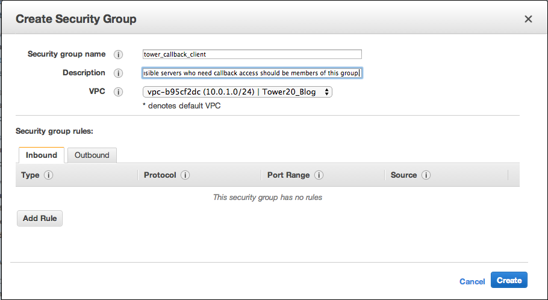  


####Tower Server Security Group
Create a custom security group for your Tower instance to live in.  I give myself access to SSH, HTTPS, and 8080, and I give members of the security group I created above access to HTTPS as well.  Make a note of the group ID after it is created.

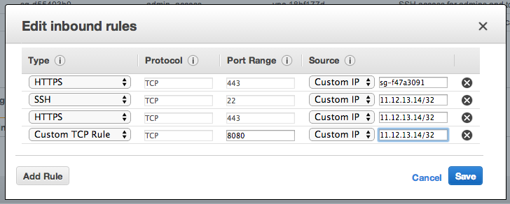  

The security group should allow you to SSH into the Tower instance, have HTTPS access to the Tower instances, and should be reachable by HTTPS by your managed instances for the callback feature to work.  

#### Tower Client Security Group
This group is assigned to the instances that are managed by Tower.  It allows Tower to SSH into the instances.

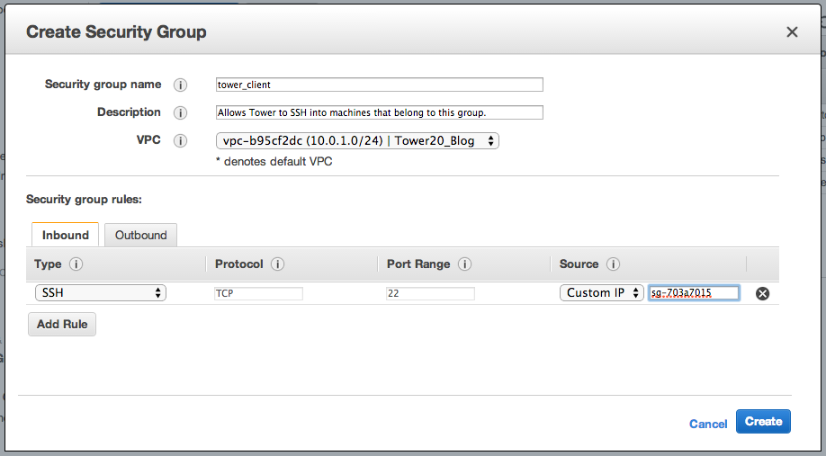


### Launching the Tower instance

```Put quick instructions on launching an instance with the proper security group, vpc, subnet we mentioned in the previous steps.  Provide instruction on how to download Tower, get license, and run Setup.```


## Basic Tower Configuration
	

Now open your browser and go to https://myinstance.compute-1.amazonaws.com and login to Tower with **admin**** as the user and **password**** as the passsword.  You'll be prompted to paste your license in there.

## Create an Organization


First, you'll want to create an Organization, typically named after the Organization you're working for.  In this case, we'll call our organization MyOrg.

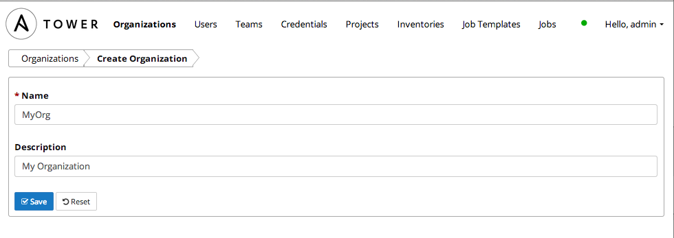

We don't need to create any additional users or teams for the purposes of this demo.

## Configuring Tower Credentials

The next step is to configure some credentials for Tower.  Click on the Credentials tab and then click on the + icon to add a new set of credentials. 

### AWS Credentials:

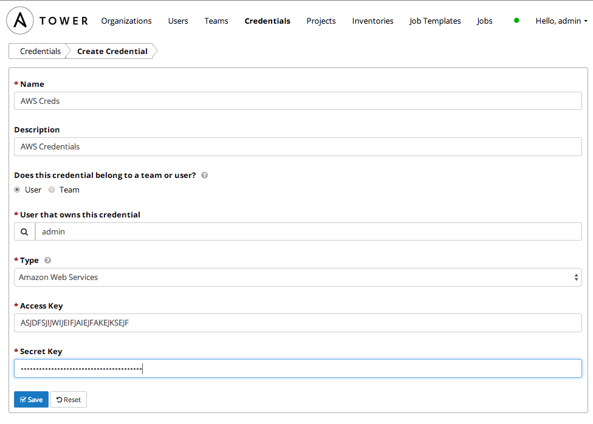

### SSH Credentials

Now we'll configure a set of credentials that Tower will use to SSH to the instances.  These must be the ec2 keypair you created earlier.  

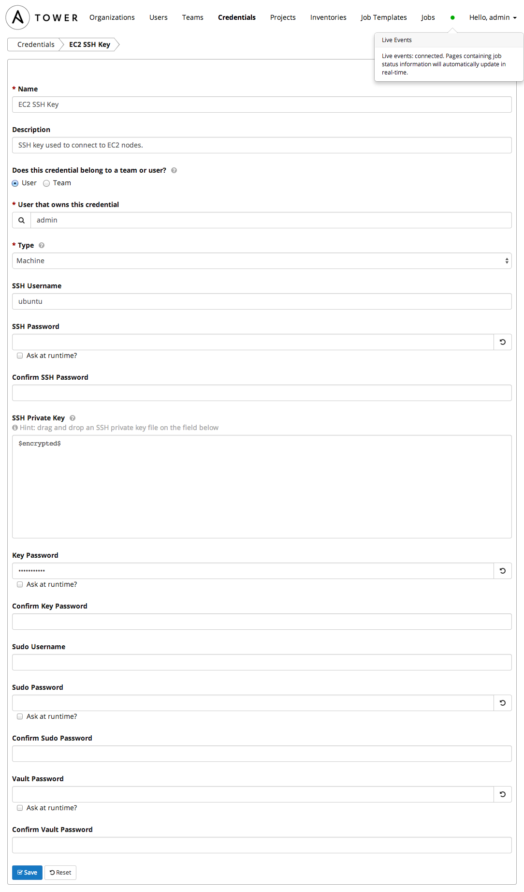


## Setting up Tower to pull playbooks from GitHub

I've already created a project on Github that covers what we need to do.  That project [can be found here](https://github.com/jsmartin/the_light).  To add that project to Tower, perform the following steps:  

Click the Projects Tab, and click the + icon to add a new project.  Fill in the form as described below:

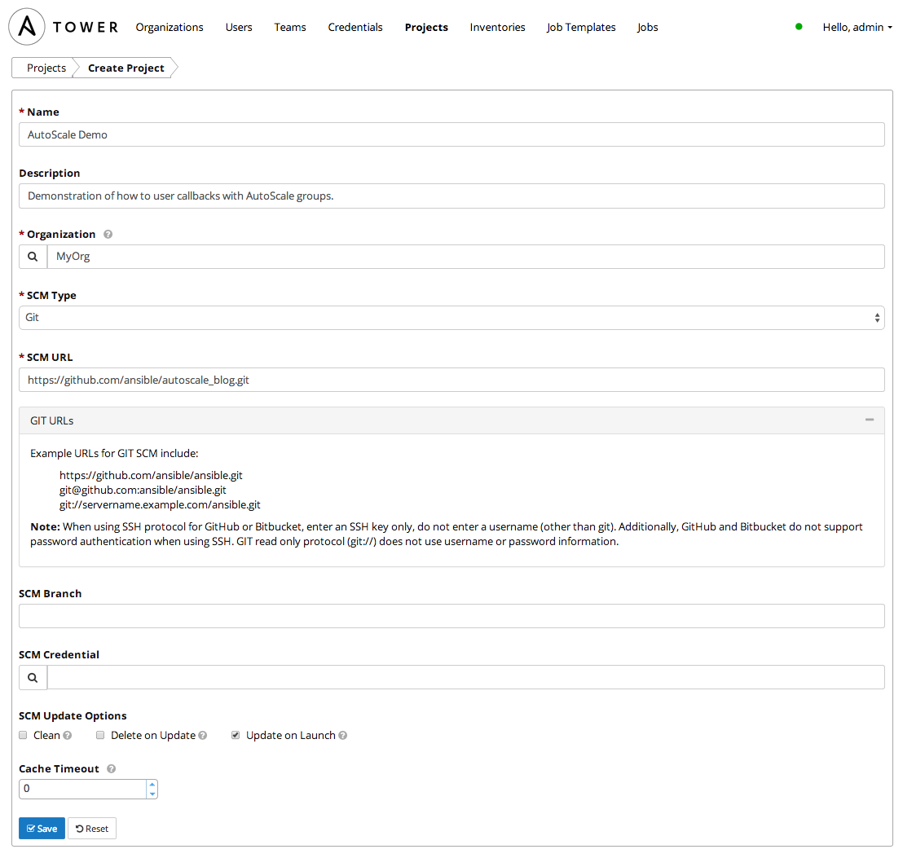


## Configuring Tower to synchronize EC2 inventory

### Create the Inventory

Click on the Inventory tab and click on the + icon to add a new inventory and fill out that form as below:

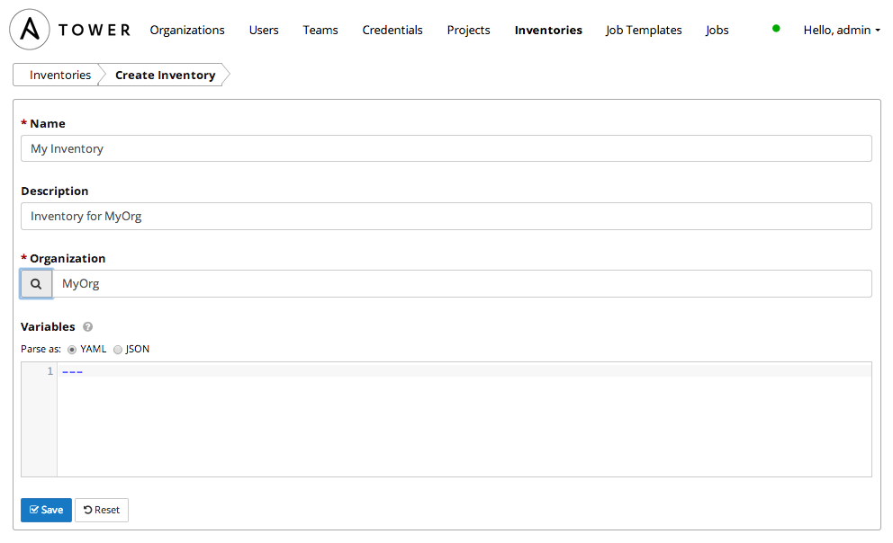


### Create the Inventory Group
Click on the newly created Inventory and click the + symbol to add a new group.  Fill out the form as below:

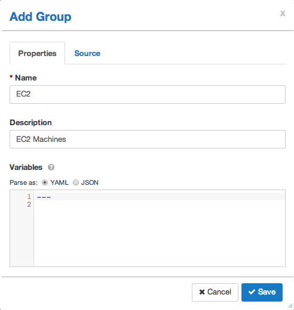

Click the Source tab and fill out the form as below.  Make not to set the Source Variables:

    ---
    vpc_destination_variable: private_ip_address

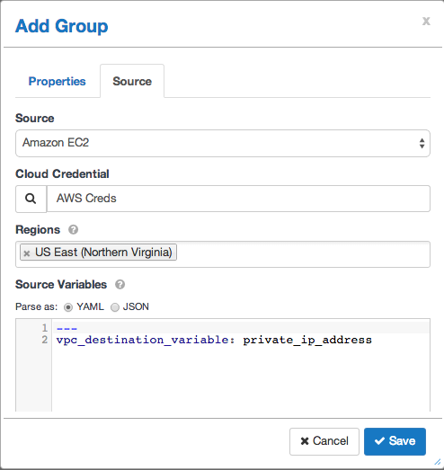

Now click on the **Start sync process** icon.  


## Creating the Job Templates

We are going to use 2 seperate job templates, one for provisioning the requisite EC2 infrastructure, and one for configure the instances in an autoscale group.

### Creating the Configuration Template
This template will be used to configure the applications -- it is launched with config.yml playbook.

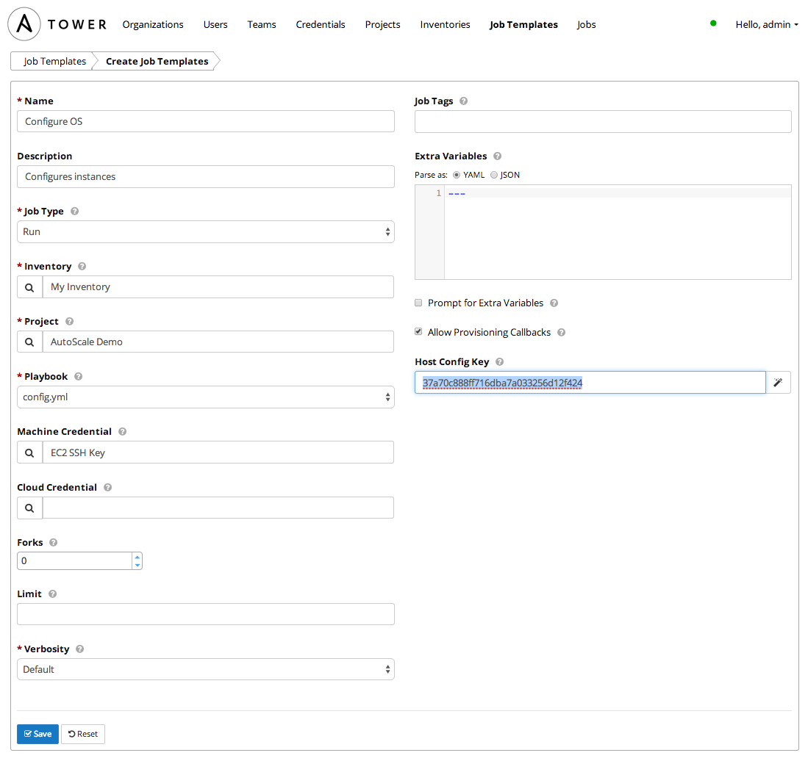

Click on the **Allow Callbacks** check box.  After doing so two additional textboxes  will appear: Callback URL and Host Config Key.

Click on the Magic Wand icon to the right of the Host Config Key text box.

After hitting Save, a dialog will appear with the call back URL and Host Key.  Make note of the host configuration key and the job template ID (highligthed below).  These are unique to your Tower install, so please do not use the values below, they are only provided for example.

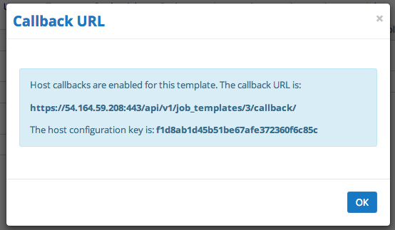

Host callbacks are enabled for this template. The callback URL is: /api/v1/job_templates/3/callback/
The host configuration key is: ``` f1d8ab1d45b51be67afe372360f6c85c```


## Creating the Infrastructure Provisioning Job Template

This job template will be used to spin up the EC2 infrastructure using the infra.yml playbook.  

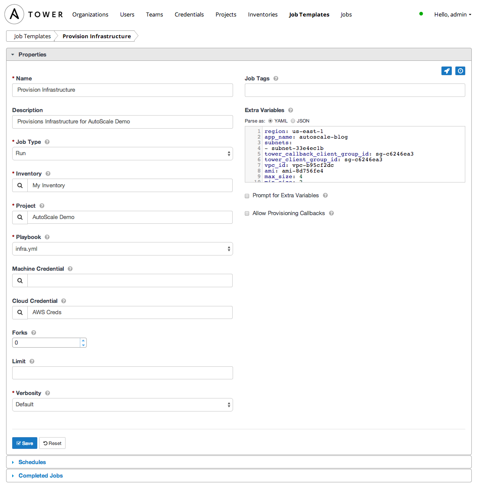

In the Extra Variables section, paste in the following in, making sure you substitue the key_name, vpc_id, tower_group, tower_address, template_id, and host_config_key with the values we discovered earlier. If you're using a region other than us-east1, you'll have to substitue the proper AMI for a RHEL 6.5 instance as well.


	region: us-east-1
	app_name: autoscale-blog
	subnets:
	- subnet-33e4ec1b
	tower_callback_client_group_id: sg-c6246ea3
	tower_client_group_id: sg-c6246ea3
	vpc_id: vpc-b95cf2dc
	ami: ami-8d756fe4
	max_size: 4
	min_size: 2
	desired_capacity: 2
	key_name: jmartin-autoscale-blog
	tower_address: 10.0.1.131
	template_id: 3
	host_config_key: f1d8ab1d45b51be67afe372360f6c85c
	instance_size: m1.small


Assign the AWS credentials we created earlier using the **Cloud Credentials** dialog.  When launched,  template will create the following items:

### EC2 Infrastructure 

| Item  | Description |
|-----------------------------|------------------------------|
| App Security Group | Self-referencing group that allows members of this group to access all ports of members. |
| Load Balancer | A load balancer for the app servers. |
| Launch Configuration | A configuration used by the AutoScale group. |
| AutoScale Group | Defines the number of instances and the load balancer membership. |
| Scale Up & Down Policies | Policies that when alarmed will dictate change to occur on AutoScale group.  |
| Scale Up & Down Alarms | Alarms that will trigger their relative scale up and down policies. |


## Running the Playbooks

First we'll need to provision the AWS infrastructure, and we'll kick that off interactively.  Click the rocket icon next to the *Provision Infrastructure* job template.


You'll be taken to a new screen that will show you the status of your job run.  When that job run is complete, i tshould look something like this:

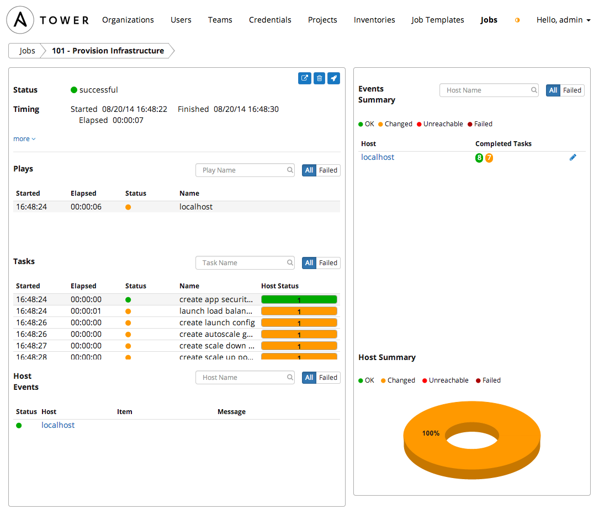

We need to get the CNAME of the ELB that was launched and we'll use this to verify that instances are actually server web pages later. To do so, click on the task that says "launch load balancer". Then Under *Host Events*, click the localhost item.

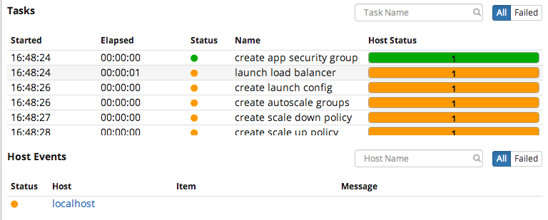

Now a new window pops up, showing the result of that particular task.  Click the *Results* tab and see find the *dns_name*.  Make note of it.  We'll use that in our browser later to make sure everything is working.

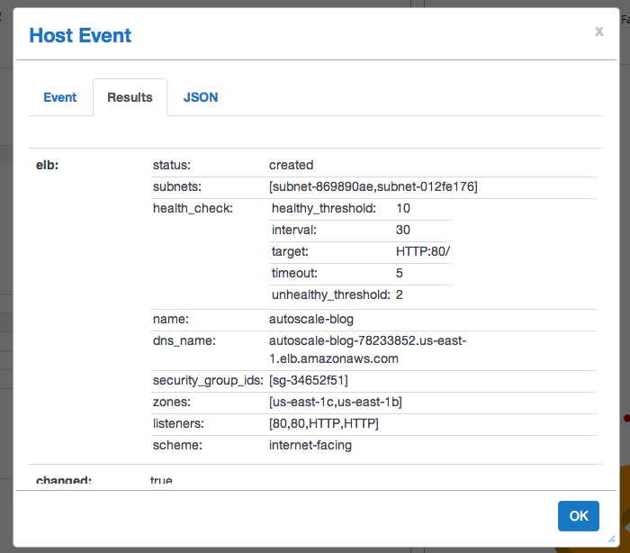

While you've been performing these actions, the following has happened

1. The EC2 infrastructure playbook is run and all EC2 components described in the EC2 infrastructure table are created.
2. The AutoScale Group is created and the initial 2 instances are launched
3. That script phones home to Tower and requests Tower to configure the server with the template ID (in this case, the Configure Application template) that is in the URL.
4. Tower checks to make sure that the instances are part of the inventory specified in the job template and also validates the host configuration key.
5. Tower then configures the instances with the Configure OS job template.
6. Instances are reachable via the load balancer URL.


You can verify the callback happened by taking a look back at the Jobs tab.  You should see 2 new jobs with the name of *Configure OS*.  Those were the jobs that were launched via the callback mechanism.

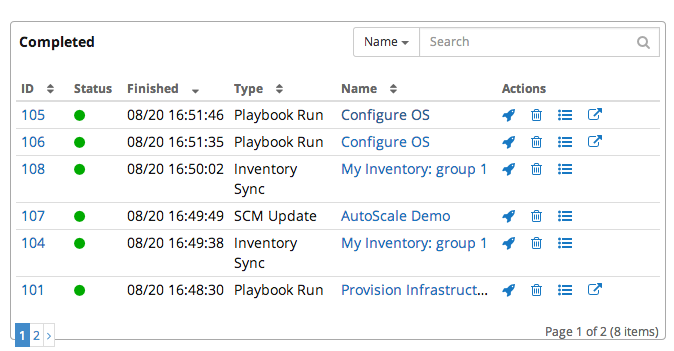


Now to top if all off, let's curl the ELB CNAME we gathered earlier and verify that we're actually serving content:


	myshell:~ curl autoscale-blog-78233852.us-east-1.elb.amazonaws.com
	This is a test - Ubuntu 12.04  <br>
	Current Host: ip-10-11-3-49 <br>


## Additional Testing

You can tweak our ASG group to increase the number of instances, or create traffic that causes a trigger to initiate an AutoScale event to test further.


That's all, all folks!


